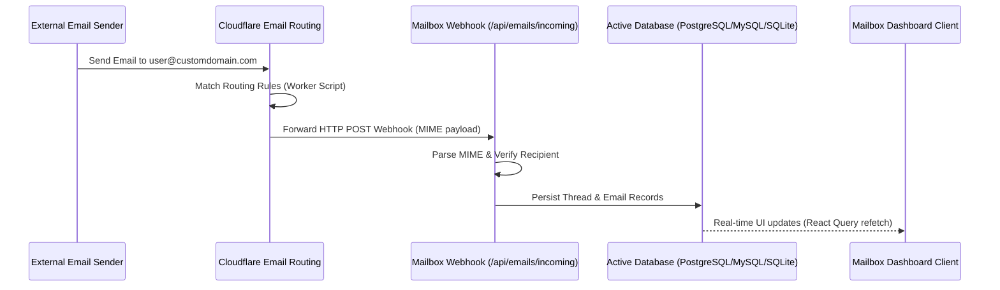

# Mailbox - Next.js Email Service Platform

A modern, production-ready, self-hosted email client and management platform built on **Next.js 16** (App Router) and **Prisma 7**. Mailbox acts as a complete solution for teams looking to manage incoming/outgoing email routing with full localization, multi-database flexibility, and robust user access control.

---

## 📖 System Overview & How It Works

Mailbox sits between your DNS provider (Cloudflare) and your application users. It handles incoming email streams by automatically configuring mailboxes, routing rules, and script webhook processors on your domain, allowing you to view and interact with incoming mail inside a beautiful, real-time UI.

### Inbound Email Routing Flow



---

## 🛠 Tech Stack

The application relies on a solid, modern stack optimized for speed, reliability, and ease of self-hosting:

- **Core Framework**: [Next.js 16](https://nextjs.org/) (React 19, App Router, Server Actions, Standalone Output).
- **ORM & Database Layer**: [Prisma 7](https://www.prisma.io/) supporting zero-config database swapping.
- **Styling & UI**: Tailwind CSS (flexible CSS-variables configuration), modern accessible components, and [Hugeicons React](https://hugeicons.com/) registry.
- **Client State & Caching**: [Tanstack React Query (v5)](https://tanstack.com/query/latest) for efficient data fetching, pagination, caching, and optimistic UI updates.
- **Localization (i18n)**: [next-intl](https://next-intl-docs.vercel.app/) with cookie-based language routing (supports English and Spanish).
- **Authentication**: Cookie-based custom session handling with secure password hashing via `bcryptjs` and strict owner/admin/member authorization layers.

---

## 🏗 Strict 4-Layer Architecture

To maintain code quality and separation of concerns as the project grows, development follows a strict upward data flow convention:

```
Repositories ──> Services ──> React Query Hooks ──> UI Components
```

1. **`src/repositories/` (Database Layer)**: Handles raw database queries, inserts, and updates using Prisma. **Strict rule**: No business logic is allowed here.
2. **`src/services/` (Business Logic Layer)**: The backend brain. Validates inputs, formats data payloads, enforces authorization guards, and computes service logic.
3. **`src/queries/` (Query Bridge Layer)**: Bridges components to backend APIs using Tanstack React Query hooks. Manages cache keys, mutations, and API requests.
4. **`src/components/` & `src/app/` (UI Layer)**: React page and design components. Presentation only. Direct database or heavy service logic calls are strictly forbidden here.

### Centralization Rules

- **Types**: Shared TypeScript interfaces, types, and Zod validator schemas must be declared in `src/types/index.ts`.
- **Icons**: Every SVG icon or icon imported from libraries must be registered in the central registry at `src/components/icons/index.ts` instead of importing directly.
- **Authentication**: All session handling, cryptographic operations, cookie rules, and auth constants live strictly in `src/lib/auth.ts`.

---

## 🚀 Getting Started

### Prerequisites

- **Node.js** v20.x or higher
- **npm** v10.x or higher
- **Docker & Docker Compose** (Optional, required for local PostgreSQL/MySQL)

### 1. Installation

Clone the repository and install the dependencies:

```bash
npm install
```

### 2. Configure Environment Variables

Copy the default configuration:

```bash
cp .env.example .env
```

Open `.env` in your editor. The file contains annotated blocks. By default, it is configured for instant SQLite local development.

### 3. Initialize the Database

Generate the client types and synchronize the schema:

```bash
npm run db:generate
npm run db:push
```

### 4. Launch the Development Server

```bash
npm run dev
```

Open [http://localhost:3000](http://localhost:3000) to view your new workspace.

---

## 🗄 Database Setup & Switching Architecture

Mailbox supports swapping database engines dynamically without changing any codebase logic. Simply uncomment the relevant database configuration in your `.env` file and execute the sync commands.

### Database Setup Scenarios

#### Flow A: SQLite (Default Local Dev)

For instant local prototyping without spinning up containers:

1. Ensure the SQLite datasource block is active in `.env`.
2. Generate Prisma Client: `npm run db:generate`
3. Push schema changes directly: `npm run db:push`
4. Load mock seed data: `npm run db:seed`

#### Flow B: Local PostgreSQL / MySQL (With Docker)

To test with production-like database engines locally:

1. Start the containerized databases: `npm run docker:up`
2. Uncomment the PostgreSQL or MySQL block in your `.env`.
3. Generate Client: `npm run db:generate`
4. Apply migrations: `npm run db:migrate`

#### Flow C: Serverless PostgreSQL (Neon / Supabase)

When deploying to cloud providers using transaction connection poolers:

1. Copy the pooled connection string into `DATABASE_URL` in `.env`.
2. Generate Client: `npm run db:generate`
3. Push schema directly: `npm run db:push` (This bypasses lock restrictions often imposed by serverless transactional proxies during standard migrations).

---

## ☁️ Cloudflare Email Integration Setup

Mailbox links directly to Cloudflare's Email Routing engine to manage incoming addresses programmatically.

> [!NOTE]
> **Receiving vs. Sending:** This Cloudflare integration is strictly configured for **receiving incoming emails** to your domain (forwarded to your Next.js webhook). To **send emails** from the platform, you must configure your outgoing SMTP connection parameters in the `.env` settings.

1. **Get your Cloudflare credentials**:
   - Go to your Cloudflare Dashboard.
   - Create an API Token under **My Profile > API Tokens** with permissions:
     - `Zone - Zone Settings: Edit`
     - `Zone - Email Routing: Edit`
     - `Zone - Workers Scripts: Edit`
2. **Link Domain in Mailbox Settings**:
   - Navigate to the **Settings** panel in the Mailbox UI.
   - Provide your **API Token**, select the active routing domain, and enter your application's public URL.
   - Click **Link Domain**. Mailbox will automatically write a Worker script to forward all incoming mail to your application webhook endpoint.

---

## 🐳 Docker Deployment & Logs

Run the application inside a multi-stage Docker environment:

| Command               | Action                                                       |
| :-------------------- | :----------------------------------------------------------- |
| `npm run docker:up`   | Builds, creates, and starts all containers in detached mode. |
| `npm run docker:down` | Stops and destroys running containers.                       |
| `npm run docker:logs` | Follows stdout/stderr logs from all active containers.       |

---

## 🚢 Production Deployment

### Deploying to Vercel

1. Set the **Framework Preset** to Next.js.
2. Configure your environment variables (`DATABASE_URL`, etc.).
3. Set your **Build Command** to:
   ```bash
   npm run vercel-build
   ```
   _This automatically handles Prisma client generation, applies database migrations, and compiles the Next.js standalone server._

### Self-Hosting (VPS)

Clone the repository to your host instance, prepare the `.env` file, and boot the system:

```bash
npm run docker:up
```

---

## 📄 License

This project is licensed under the **Business Source License 1.1 (BUSL-1.1)** — free for personal and non-commercial use, commercial use requires a paid license. See the [LICENSE](file:///Users/abc/Desktop/email-service/LICENSE) file for full terms or contact **prashantnigam490@gmail.com** for commercial inquiries.


